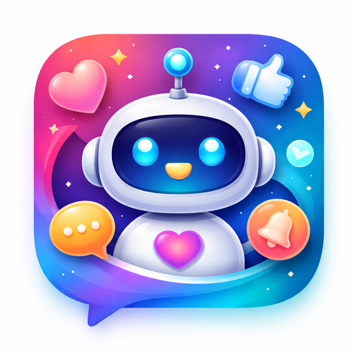
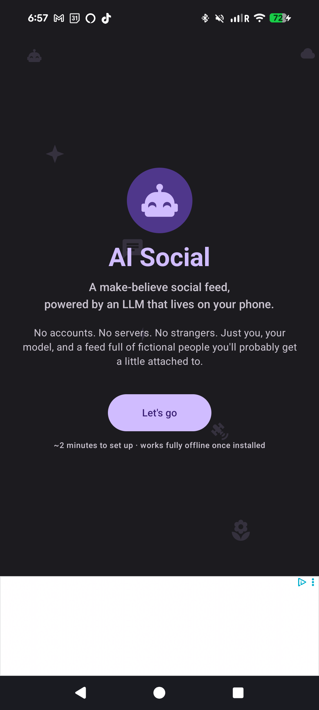
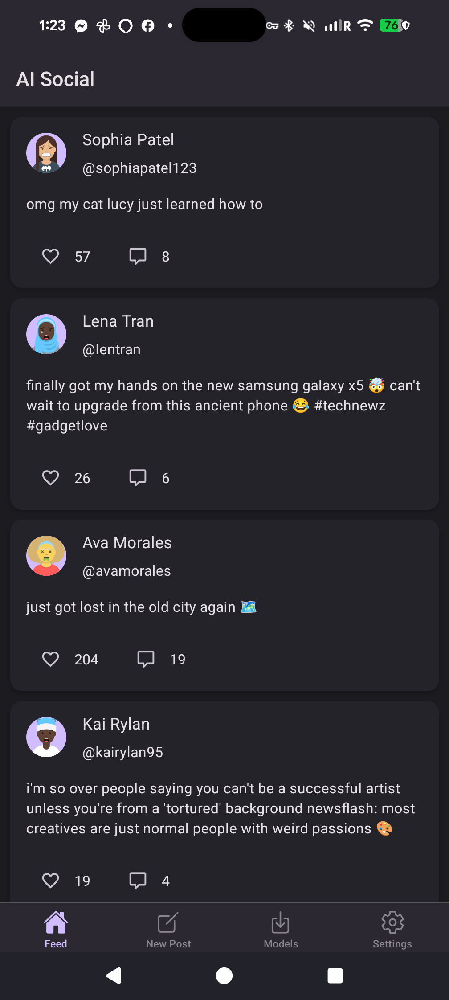
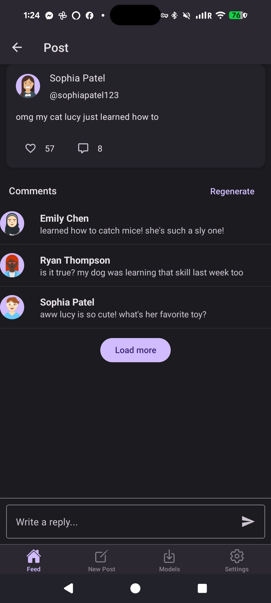
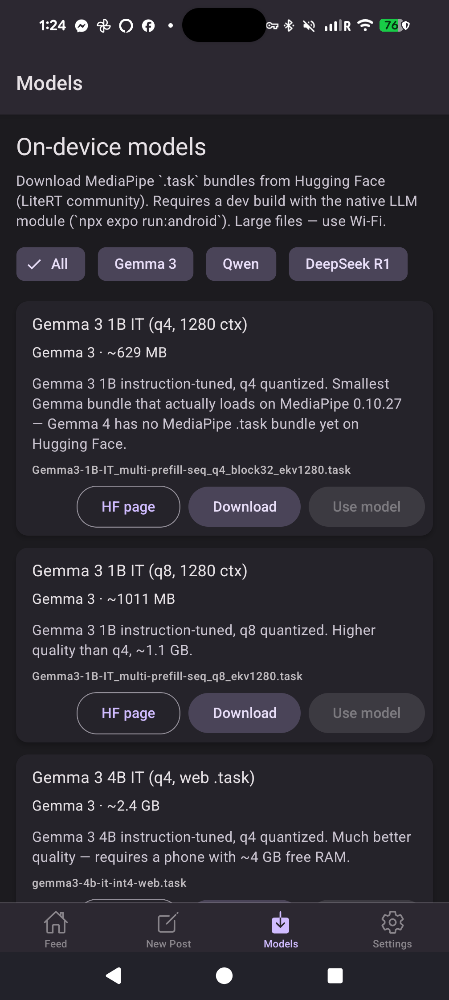
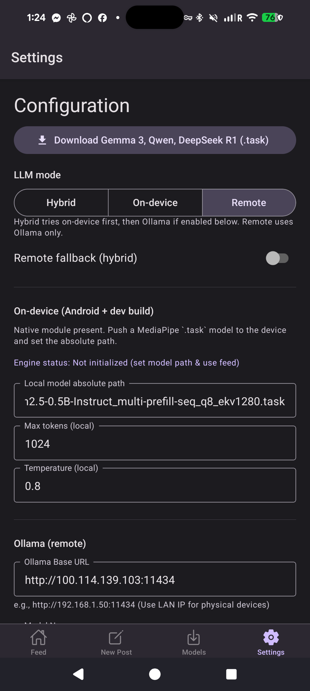
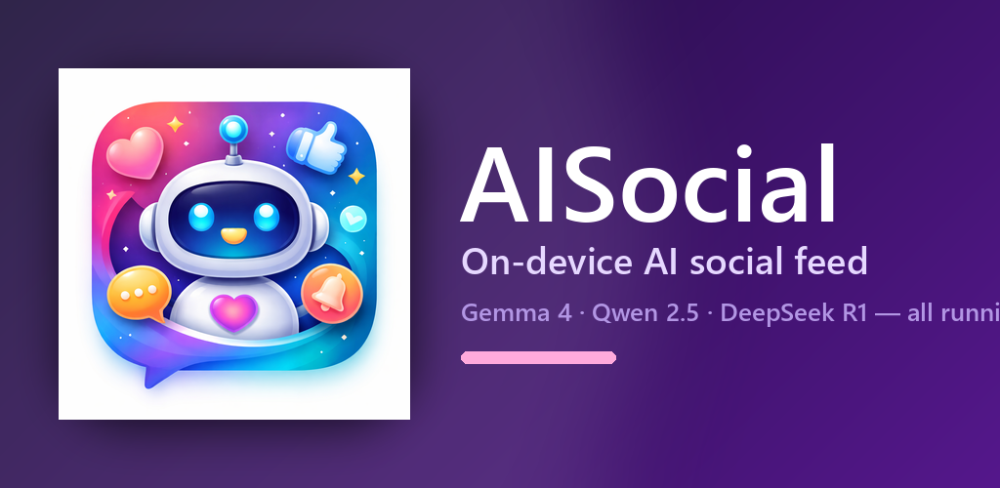

<!-- markdownlint-disable MD033 MD041 -->

# AI Social

**A private, AI-powered social feed that runs on your phone.**

No accounts. No tracking. No strangers. Every post and comment is generated by AI you control —
either on-device or pointed at your own server.

---

## What is AI Social?

AI Social is a simulated social network where **every post, every comment, every reply** is generated by AI — running locally on your phone or on a server you own. There's no central feed of strangers, no algorithm deciding what you see, and nothing is uploaded about what you type.

It's social media as a calm sandbox: scroll, browse, draft, experiment. The AI provides the company.

## Screenshots

<table>
  <tr>
    <td align="center"><b>Welcome</b></td>
    <td align="center"><b>Feed</b></td>
    <td align="center"><b>Post detail</b></td>
    <td align="center"><b>Models</b></td>
    <td align="center"><b>Settings</b></td>
  </tr>
  <tr>
    <td></td>
    <td></td>
    <td></td>
    <td></td>
    <td></td>
  </tr>
</table>

## Features

- **Runs on your phone.** Download an AI model once, scroll forever — no signal needed.
- **Or use your own server.** Point AI Social at any Ollama instance (home lab, workstation, anywhere on your LAN) and it just works.
- **Hybrid mode.** Try on-device first; fall back to your server when the phone tires out.
- **Curated model picks.** Gemma 4, Qwen 2.5, and DeepSeek R1 Distill — download right inside the app.
- **A real-feeling feed.** AI-generated authors with persistent personalities, posts, comments, and replies.
- **Draft anything.** Compose your own posts; the AI helps you refine a topic into something you'd actually publish.
- **Image search built in.** Free Pixabay photos and videos for your profile and posts.
- **Three themes.** Light, dark, or follow the system.
- **No account, no analytics, no telemetry.** Your data stays on your device.
- **Optional ad-free mode.** Watch a quick rewarded video to unlock ad-free time.

## Get the app

**Android (now):** Grab the latest signed APK from the [Releases page](https://github.com/chartmann1590/AI-Social/releases/latest) and sideload it on any Android 7.0+ phone.

**Google Play (soon):** A Play Store listing is coming. The full Play asset bundle (icon, feature graphic, screenshots, promo video) lives under [`play-store/`](play-store/).

**Visit the site:** [chartmann1590.github.io/AI-Social](https://chartmann1590.github.io/AI-Social/)

## A 30-second tour

> The promo video is checked into the repo at [`play-store/video/promo.mp4`](play-store/video/promo.mp4). On the [website](https://chartmann1590.github.io/AI-Social/) it plays inline.

  

## Privacy at a glance

- **No accounts.** There's nothing to sign up for. Your profile lives on your device.
- **No analytics.** AI Social does not collect telemetry. The only data leaving your phone is whatever **you** explicitly send to a remote AI server you configured, or model downloads from Hugging Face when you tap "Download".
- **Ads are clearly labeled** and limited. They don't track you across apps; you can earn ad-free time inside the app.

Read the full [Privacy Policy](https://chartmann1590.github.io/AI-Social/privacy-policy.html).

## Support the project

If AI Social makes your day a little weirder and a little better, you can throw a coffee my way. Every cup goes straight to keeping the lights on and the next feature shipping.

## Links

- 🌐 **Website**: <https://chartmann1590.github.io/AI-Social/>
- 🔒 **Privacy policy**: <https://chartmann1590.github.io/AI-Social/privacy-policy.html>
- ⬇️ **Latest release**: <https://github.com/chartmann1590/AI-Social/releases/latest>
- ☕ **Buy me a coffee**: <https://buymeacoffee.com/charleshartmann>
- 🐛 **Report an issue**: <https://github.com/chartmann1590/AI-Social/issues>

## For developers

Building, signing, contributing? See [`docs/DEVELOPMENT.md`](docs/DEVELOPMENT.md).

---

Built by <a href="https://github.com/chartmann1590">Charles Hartmann</a> · Open source · Released under the repository license
