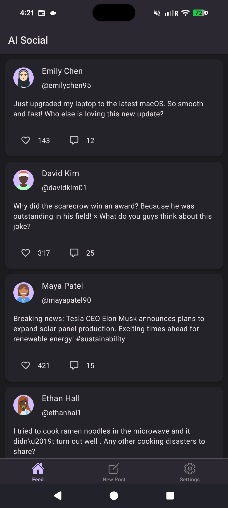
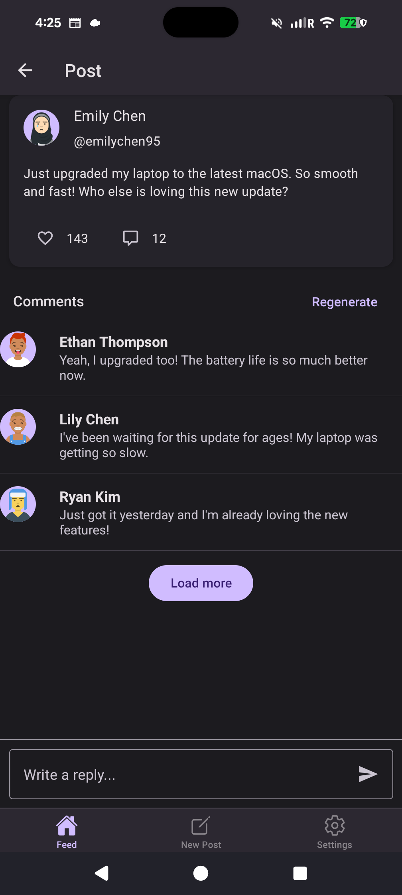
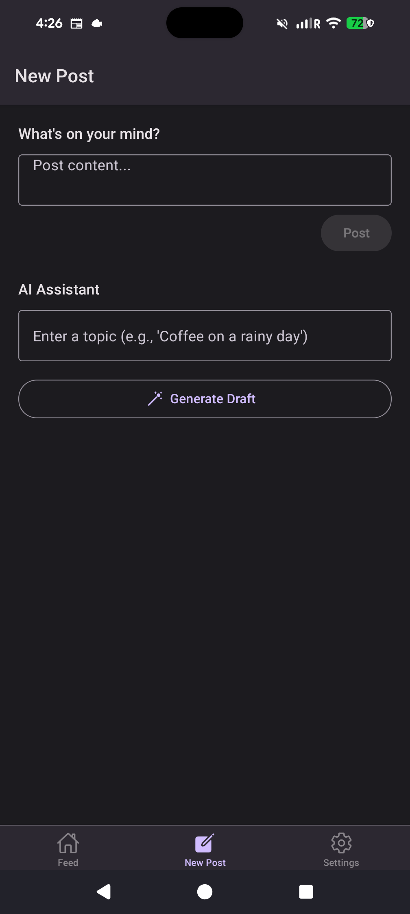
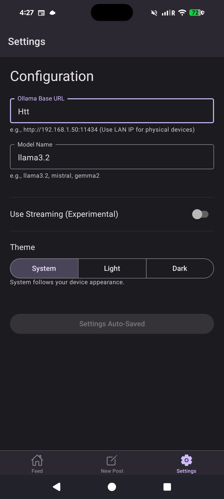

# AI Social
A React Native + Expo app that simulates a social media experience. Inference can use **remote Ollama** and/or **on-device MediaPipe LLM Inference** (LiteRT-compatible `.task` models on Android).

## Stack
- Expo (managed workflow) + React Native
- React Navigation + React Native Paper
- Zustand for state
- Unified LLM layer: `src/services/llm/` (Ollama HTTP + Android native bridge)
- Optional: `com.google.mediapipe:tasks-genai` (wired by Expo config plugin)

## Project Structure
- `index.ts` and `App.tsx` are the entry points.
- `src/screens/` — feed, compose, settings, post detail, **Models**, and **About**.
- `src/screens/onboarding/` — first-run flow: Welcome → Profile → Model setup → Tour (gated until `onboardingComplete` in the user store).
- `src/components/` holds reusable UI like `PostCard`.
- `src/services/llm/` — `LlmService` facade, remote Ollama provider, Android LiteRT/MediaPipe provider.
- `src/services/modelDownload.ts` — curated Hugging Face bundle downloads and local path helpers for on-device models.
- `src/services/ollama.ts` — re-exports `LlmService` for backward compatibility.
- `plugins/withLiteRtLlm.js` — Expo config plugin (Gradle dependency + Kotlin sources + `MainApplication` registration).
- `src/data/onDeviceModels.ts` — Curated downloadable `.task` bundles (Gemma 4, Qwen 2.5, DeepSeek R1 distill).
- **Models** tab — full catalog: download bundles into app storage and set the local model path (overlaps with onboarding model setup).
- **About** — open from the information icon on the Settings screen header.
- `src/store/` contains Zustand stores (settings, user/onboarding flags, feed data).
- `src/config.ts` holds local runtime config (see `src/config.example.ts`).
- `assets/` contains app icons and images.
- `play-store/` — Play Console listing copy, data-safety notes, and graphic placeholders; see `play-store/README.md`.

## Screenshots
<table>
  <tr>
    <td align="center">Feed</td>
    <td align="center">Comments</td>
    <td align="center">New Post</td>
    <td align="center">Settings</td>
  </tr>
  <tr>
    <td></td>
    <td></td>
    <td></td>
    <td></td>
  </tr>
</table>

## First launch (onboarding)
New installs start in an onboarding stack instead of the main tabs. You move through **Welcome**, set a **Profile** (display name and optional avatar), optionally pick or download a model on **Model setup** (curated picks; you can skip and configure later in **Models** / **Settings**), then a short **Tour**. When onboarding finishes, the bottom tab bar appears (**Feed**, **New Post**, **Models**, **Settings**). Completion is stored in Zustand (`onboardingComplete`).

## Setup
1. Install Node.js (LTS).
2. For **remote** mode or hybrid fallback: install and start Ollama (`ollama serve`).
3. Install dependencies:
   ```powershell
   npm install
   ```
4. Configure defaults (optional):
   - Copy `src/config.example.ts` to `src/config.ts` if needed.
   - Set `OLLAMA_BASE_URL` and `OLLAMA_MODEL`.
   - For Android emulator: `http://10.0.2.2:11434` is typical.
   - For physical devices: use your LAN IP (for example, `http://192.168.1.50:11434`).

## LLM modes (Settings)
- **Hybrid** (default): tries **on-device** inference on Android when a local model path is set; if that fails and **Remote fallback** is on, uses **Ollama**.
- **On-device**: Android only, requires a **development build** with native code (`expo prebuild` / `expo run:android`). Set **Local model absolute path** to a MediaPipe-compatible `.task` file on the device (models are large — often pushed with `adb` or downloaded at runtime; see [LLM Inference for Android](https://ai.google.dev/edge/mediapipe/solutions/genai/llm_inference/android)).
- **Remote**: uses Ollama only (`OLLAMA_BASE_URL` / model name in Settings).

**Expo Go** does not include the native module; use a dev build for on-device inference.

## Android on-device (dev build)
1. Ensure `app.json` includes the config plugin `./plugins/withLiteRtLlm.js` (already added).
2. Generate native projects and build (from project root):
   ```powershell
   npx expo prebuild --platform android
   npx expo run:android
   ```
3. **Option A — in-app downloads:** open the **Models** tab, pick **Gemma 4**, **Qwen**, or **DeepSeek R1**, tap **Download**, then **Use model** (files are large; use Wi‑Fi).  
4. **Option B — adb:** push a compatible `.task` model, for example:
   ```powershell
   adb shell mkdir -p /data/local/tmp/llm
   adb push path\to\your_model.task /data/local/tmp/llm/model.task
   ```
   Then in **Settings**, set **Local model absolute path** to that path.
5. Choose **Hybrid** or **On-device** in Settings, then generate the feed.

If `MainApplication` no longer matches the plugin’s regex after an Expo upgrade, manually register `LiteRtLlmPackage()` in `android/.../MainApplication.kt` next to `PackageList(this).packages` and add the corresponding `import`.

## App Settings
- **LLM mode** / **Remote fallback** / **Local model path** / token & temperature overrides.
- Theme: System, Light, or Dark.
- Streaming: toggle "Use Streaming" for experimental streaming behavior (remote path).

## Run Locally
- Start the dev server: `npm run start`
- Android emulator: `npm run android` (after prebuild if using native LLM)
- Android release variant (local Gradle): `npm run android:release` then install with `npm run android:deploy` (Windows helper around `gradlew.bat installRelease`).
- iOS simulator (macOS only): `npm run ios`
- Web: `npm run web`
- If Metro acts up: `npx expo start -c`

## Device Testing (Development Build)
- Android (USB): enable USB debugging, plug in your device, then run `npm run android`.
  - To target a specific USB device non-interactively, set `ANDROID_SERIAL` (see `adb devices`) and use a device label Expo recognizes, e.g. `npx expo run:android -d Pixel_8_Pro`, or install with Gradle: `cd android; $env:ANDROID_SERIAL='…'; .\gradlew.bat :app:installDebug`.
  - `android/gradle.properties` limits native builds to **arm64-v8a** by default for faster installs on modern phones; add x86 ABIs back if you need the emulator.
  - If Metro is on port 8082, run `adb reverse tcp:8082 tcp:8082`.
- iOS: requires macOS + Xcode, then run `npm run ios`.

## Test on Your Phone (Expo Go)
1. Install Expo Go on your device.
2. Ensure your phone and dev machine are on the same Wi-Fi.
3. Set `OLLAMA_BASE_URL` to your machine's LAN IP (not `localhost`) for remote/hybrid fallback.
4. Start the dev server: `npm run start`.
5. Scan the QR code (iOS Camera or Expo Go on Android).

Note: Expo Go runs inside the Expo container and **does not load** the custom on-device LLM native module — use **Hybrid** with fallback or a **dev build** for local inference.

## Release Builds (EAS)
Use EAS Build for installable binaries and store distribution. For Google Play copy, graphics placeholders, and a device-side checklist, use the files under `play-store/` (see `play-store/README.md`).
- One-time setup: `npm install -g eas-cli` then `eas login`.
- Configure the project: `eas build:configure` (creates `eas.json`).
- Build:
  - Android APK/AAB: `eas build -p android`
  - iOS IPA: `eas build -p ios` (requires an Apple developer account)
- Optional submit to stores: `eas submit -p android` or `eas submit -p ios`.
Keep secrets and API keys out of git; use EAS secrets or environment variables as needed.

## Security & Secrets
- `src/config.ts` is intentionally ignored by git. Do not commit local URLs or credentials.
- `android/local.properties` and generated native folders are machine-specific and should stay untracked.
- Never commit signing keys or certificates (`*.jks`, `*.p8`, `*.p12`, `*.key`, `*.pem`).

## Troubleshooting
- Posts not loading (remote): verify Ollama is running and reachable on the LAN IP, allow firewall access to port 11434, and set `OLLAMA_HOST=0.0.0.0` if the server must bind to all interfaces.
- JSON parse errors: try a larger model (for example, `llama3` or `mistral`) or tighten prompts; on-device models may need smaller batch sizes / fewer items per request.
- On-device: confirm **dev build** (not Expo Go), correct **absolute path** to the `.task` file, and a device class supported by MediaPipe LLM Inference (see Google’s docs — emulators are often unsupported).

## Verification (manual)
- `npx tsc --noEmit` — TypeScript check.
- **Remote**: Settings → Remote → generate feed / comments / draft with Ollama running.
- **Hybrid + fallback**: invalid local path → should still work via Ollama when fallback is on.
- **On-device**: dev build + valid model path → feed generation without Ollama.
